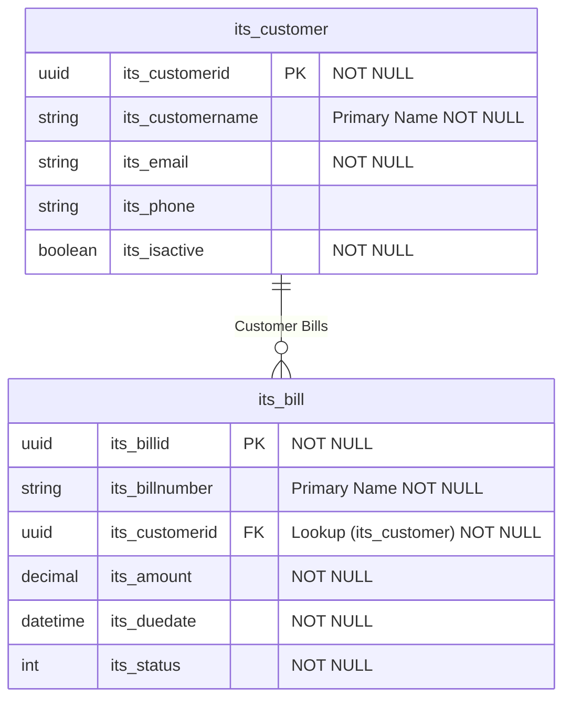

# Dataverse MCP Server

A Model Context Protocol (MCP) server for Microsoft Dataverse that enables schema operations including creating and updating tables, columns, relationships, and option sets using the Dataverse Web API.

## 🚀 Key Features

✅ **Manage Tables & Columns** - Create, update, delete, and list custom tables with all column types (String, Integer, Boolean, DateTime, Picklist, Lookup, AutoNumber, etc.)

✅ **Manage Relationships** - Create One-to-Many and Many-to-Many relationships between entities with proper cascade behaviors

✅ **Manage Option Sets** - Create and manage global option sets with custom options, colors, and values

✅ **Solution-Based Architecture** - Enterprise-grade solution management with persistent context and automatic customization prefixes

✅ **Security & Access Control** - Complete security role management, team operations, and business unit hierarchy management

✅ **WebAPI Call Generator** - Generate ready-to-use HTTP requests, cURL commands, and JavaScript code for any Dataverse operation

✅ **PowerPages WebAPI Generator** - Generate PowerPages-specific WebAPI calls using the `/_api/[logicalEntityName]` format with React examples

✅ **PowerPages Configuration Management** - Manage table permissions and WebAPI site settings for PowerPages Code Sites with YAML file automation

✅ **Schema Export & Visualization** - Export complete solution schemas to JSON with advanced filtering, then generate professional Mermaid ERD diagrams with relationship visualization

✅ **Mermaid Diagram Generation** - Convert exported schemas into professional Entity Relationship Diagrams with enhanced column markers, lookup target display, and unlimited table support

✅ **AutoNumber Column Management** - Create and manage AutoNumber columns with customizable format patterns for automatic serial numbers, reference codes, and unique identifiers

✅ **Professional Integration** - OAuth2 authentication, comprehensive error handling, and enterprise-ready deployment

✅ **Production Ready** - Comprehensive testing completed with 7 critical bugs found and fixed, 100% tool coverage achieved

## Table of Contents

- [Features](#features)
  - [Table Operations](#table-operations)
  - [Column Operations](#column-operations)
  - [AutoNumber Column Operations](#autonumber-column-operations)
  - [Relationship Operations](#relationship-operations)
  - [Option Set Operations](#option-set-operations)
  - [Solution & Publisher Operations](#solution--publisher-operations)
  - [Security Role Operations](#security-role-operations)
  - [Team Operations](#team-operations)
  - [Business Unit Operations](#business-unit-operations)
  - [Schema Export Operations](#schema-export-operations)
  - [WebAPI Call Generator](#webapi-call-generator)
  - [PowerPages WebAPI Generator](#powerpages-webapi-generator)
  - [PowerPages Configuration Management](#powerpages-configuration-management)
- [Solution-Based Architecture](#solution-based-architecture)
  - [Key Benefits](#key-benefits)
  - [Solution Workflow](#solution-workflow)
  - [Example: XYZ Organization Setup](#example-xyz-organization-setup)
  - [Persistent Solution Context](#persistent-solution-context)
- [Supported Column Types](#supported-column-types)
  - [Column Type Details](#column-type-details)
  - [Tested Column Scenarios](#tested-column-scenarios)
  - [Column Operations Status](#column-operations-status)
- [Testing & Quality Assurance](#testing--quality-assurance)
- [Prerequisites](#prerequisites)
- [Setup](#setup)
  - [1. Azure App Registration](#1-azure-app-registration)
  - [2. Create Client Secret](#2-create-client-secret)
  - [3. Create Application User in Dataverse](#3-create-application-user-in-dataverse)
  - [4. Get Required Information](#4-get-required-information)
- [Installation](#installation)
- [Configuration](#configuration)
  - [Windows MCP Configuration](#windows-mcp-configuration)
  - [Option 1: Using .env file (Recommended for MCP Server Development)](#option-1-using-env-file-recommended-for-mcp-server-development)
  - [Option 2: Using MCP environment variables (Recommended for Normal Usage)](#option-2-using-mcp-environment-variables-recommended-for-normal-usage)
  - [Option 3: Hybrid Configuration](#option-3-hybrid-configuration)
- [Usage Examples](#usage-examples)
  - [Creating a Custom Table](#creating-a-custom-table)
  - [Adding Columns to a Table](#adding-columns-to-a-table)
  - [Creating AutoNumber Columns](#creating-autonumber-columns)
  - [Creating Relationships](#creating-relationships)
  - [Managing Option Sets](#managing-option-sets)
  - [Managing Security Roles](#managing-security-roles)
  - [Managing Teams](#managing-teams)
  - [Managing Business Units](#managing-business-units)
  - [Exporting Solution Schema](#exporting-solution-schema)
  - [Mermaid Diagram Generation](#mermaid-diagram-generation)
  - [WebAPI Call Generator](#webapi-call-generator)
  - [PowerPages WebAPI Generator](#powerpages-webapi-generator)
  - [PowerPages Configuration Management](#powerpages-configuration-management)
- [Authentication](#authentication)
- [Error Handling](#error-handling)
- [Security Considerations](#security-considerations)
- [Troubleshooting](#troubleshooting)
  - [Common Issues](#common-issues)
  - [Debug Mode](#debug-mode)
- [API Reference](#api-reference)
- [Solution Management Best Practices](#solution-management-best-practices)
  - [Publisher Configuration](#publisher-configuration)
  - [Solution Context Management](#solution-context-management)
  - [Environment Promotion](#environment-promotion)
  - [Git Integration](#git-integration)
- [Developer Notebook](#developer-notebook)
  - [MCP Configuration Recommendations](#mcp-configuration-recommendations)
  - [Read-Only Tools for alwaysAllow Configuration](#read-only-tools-for-alwaysallow-configuration)
  - [Benefits of This Configuration](#benefits-of-this-configuration)
  - [Common Development Workflows](#common-development-workflows)
  - [Developer Security Considerations](#developer-security-considerations)
  - [Advanced Configuration Tips](#advanced-configuration-tips)
- [Contributing](#contributing)
- [Releasing](#releasing)
  - [Creating a Release](#creating-a-release)
  - [Automated GitHub Releases](#automated-github-releases)
  - [Manual Release Process](#manual-release-process)
- [Changelog](#changelog)
- [License](#license)
- [Support](#support)

## Features

This MCP server provides comprehensive tools for Dataverse schema management:

### Table Operations
- **create_dataverse_table** ✅ **Fully Tested** - **Create Dataverse Table**: Creates a new custom table in Dataverse with the specified configuration. Use this when you need to create a new entity to store business data. Requires a solution context to be set first.
- **get_dataverse_table** ✅ **Fully Tested** - **Get Dataverse Table**: Retrieves detailed information about a specific Dataverse table including its metadata, properties, and configuration. Use this to inspect table definitions and understand table structure.
- **update_dataverse_table** ✅ **Fully Tested** - **Update Dataverse Table**: Updates the properties and configuration of an existing Dataverse table. Use this to modify table settings like display names, descriptions, or feature enablement (activities, notes, auditing, etc.). Changes are published automatically.
- **delete_dataverse_table** ✅ **Fully Tested** - **Delete Dataverse Table**: Permanently deletes a custom table from Dataverse. WARNING: This action cannot be undone and will remove all data in the table. Use with extreme caution and only for tables that are no longer needed.
- **list_dataverse_tables** ✅ **Fully Tested** - **List Dataverse Tables**: Retrieves a list of tables in the Dataverse environment with filtering options. Use this to discover available tables, find custom tables, or get an overview of the data model. Supports filtering by custom/system tables and managed/unmanaged status.

### Column Operations
- **create_dataverse_column** ✅ **Fully Tested** - **Create Dataverse Column**: Creates a new column (field) in a Dataverse table with the specified data type and configuration. Supports various column types including text, numbers, dates, lookups, and choice lists. Use this to add new fields to store specific data in your tables. Requires a solution context to be set first.
- **get_dataverse_column** ✅ **Fully Tested** - **Get Dataverse Column**: Retrieves detailed information about a specific column in a Dataverse table, including its data type, properties, and configuration settings. Use this to inspect column definitions and understand field structure.
- **update_dataverse_column** ✅ **Fully Tested** - **Update Dataverse Column**: Updates the properties and configuration of an existing column in a Dataverse table. Use this to modify column settings like display names, descriptions, required levels, or audit settings. Note that data type cannot be changed after creation.
- **delete_dataverse_column** ✅ **Fully Tested** - **Delete Dataverse Column**: Permanently deletes a column from a Dataverse table. WARNING: This action cannot be undone and will remove all data stored in this column. Use with extreme caution and only for columns that are no longer needed.
- **list_dataverse_columns** ✅ **Fully Tested** - **List Dataverse Columns**: Retrieves a list of columns in a specific Dataverse table with filtering options. Use this to discover available fields in a table, find custom columns, or get an overview of the table structure. Supports filtering by custom/system columns and managed/unmanaged status.

### AutoNumber Column Operations
- **create_autonumber_column** ✅ **Fully Tested** - **Create AutoNumber Column**: Creates a new AutoNumber column in a Dataverse table with specified format. AutoNumber columns automatically generate alphanumeric strings using sequential numbers, random strings, and datetime placeholders. Requires a solution context to be set first.
- **update_autonumber_format** ✅ **Fully Tested** - **Update AutoNumber Format**: Updates the AutoNumberFormat of an existing AutoNumber column. This changes how future values will be generated but does not affect existing records.
- **set_autonumber_seed** ✅ **Fully Tested** - **Set AutoNumber Seed**: Sets the seed value for an AutoNumber column's sequential segment using the SetAutoNumberSeed action. This controls the starting number for future records. Note: Seed values are environment-specific and not included in solutions.
- **get_autonumber_column** ✅ **Fully Tested** - **Get AutoNumber Column**: Retrieves detailed information about an AutoNumber column including its current format, properties, and configuration.
- **list_autonumber_columns** ✅ **Fully Tested** - **List AutoNumber Columns**: Lists all AutoNumber columns in a specific table or across all tables in the environment. Helps identify existing AutoNumber implementations.
- **convert_to_autonumber** ✅ **Fully Tested** - **Convert to AutoNumber**: Converts an existing text column to an AutoNumber column by adding an AutoNumberFormat. The column must be a String type with Text format and should be empty or contain compatible data.

### Relationship Operations
- **create_dataverse_relationship** ✅ **Fully Tested** - **Create Dataverse Relationship**: Creates a relationship between two Dataverse tables. Supports One-to-Many relationships (parent-child with lookup field) and Many-to-Many relationships (junction table). Use this to establish data connections between tables, enable navigation, and maintain referential integrity.
- **get_dataverse_relationship** ✅ **Fully Tested** - **Get Dataverse Relationship**: Retrieves detailed information about a specific relationship between Dataverse tables, including its configuration, cascade settings, and menu behavior. Use this to inspect relationship definitions and understand table connections.
- **delete_dataverse_relationship** ✅ **Fully Tested** - **Delete Dataverse Relationship**: Permanently deletes a relationship between Dataverse tables. WARNING: This action cannot be undone and will remove the connection between tables, including any lookup fields for One-to-Many relationships. Use with extreme caution.
- **list_dataverse_relationships** ✅ **Fully Tested** - **List Dataverse Relationships**: Retrieves a list of relationships in the Dataverse environment with filtering options. Use this to discover table connections, find custom relationships, or get an overview of the data model relationships. Supports filtering by entity, relationship type, and managed/unmanaged status.

### Option Set Operations
- **create_dataverse_optionset** ✅ **Fully Tested** - **Create Dataverse Option Set**: Creates a new global option set (choice list) in Dataverse with predefined options. Use this to create reusable choice lists that can be used across multiple tables and columns. Option sets provide consistent data entry options and improve data quality.
- **get_dataverse_optionset** ✅ **Fully Tested** - **Get Dataverse Option Set**: Retrieves detailed information about a specific option set including its metadata, options, and configuration. Use this to inspect option set definitions and understand available choices.
- **update_dataverse_optionset** ✅ **Fully Tested** - **Update Dataverse Option Set**: Updates an existing option set by modifying its properties and managing its options. Use this to add new choices, update existing ones, remove obsolete options, or change the option set's display name and description. Changes affect all columns using this option set.
- **delete_dataverse_optionset** ✅ **Fully Tested** - **Delete Dataverse Option Set**: Permanently deletes an option set from Dataverse. WARNING: This action cannot be undone and will fail if the option set is being used by any columns. Ensure no columns reference this option set before deletion.
- **list_dataverse_optionsets** ✅ **Fully Tested** - **List Dataverse Option Sets**: Retrieves a list of option sets in the Dataverse environment with filtering options. Use this to discover available choice lists, find custom option sets, or get an overview of reusable options. Supports filtering by custom/system and managed/unmanaged status.
- **get_dataverse_optionset_options** ✅ **Fully Tested** - **Get Dataverse Option Set Options**: Retrieves all options (choices) within a specific option set, including their values, labels, descriptions, and colors. Use this to inspect the available choices in an option set and understand their configuration.

### Solution & Publisher Operations
- **create_dataverse_publisher** ✅ **Fully Tested** - **Create Dataverse Publisher**: Creates a new publisher in Dataverse. Publishers are required for creating solutions and provide customization prefixes for schema names. Use this to establish a publisher identity before creating solutions and custom components.
- **get_dataverse_publisher** ✅ **Fully Tested** - **Get Dataverse Publisher**: Retrieves detailed information about a specific publisher including its customization prefix, option value prefix, and configuration. Use this to inspect publisher properties and understand customization settings.
- **list_dataverse_publishers** ✅ **Fully Tested** - **List Dataverse Publishers**: Retrieves a list of publishers in the Dataverse environment with filtering options. Use this to discover available publishers, find custom publishers for solution creation, or get an overview of publisher configurations including customization prefixes.
- **create_dataverse_solution** ✅ **Fully Tested** - **Create Dataverse Solution**: Creates a new unmanaged solution in Dataverse. Solutions are containers for customizations and allow you to package, deploy, and manage custom components. Use this to create a solution before adding tables, columns, and other customizations.
- **get_dataverse_solution** ✅ **Fully Tested** - **Get Dataverse Solution**: Retrieves detailed information about a specific solution including its metadata, version, publisher details, and configuration. Use this to inspect solution properties and understand solution structure.
- **list_dataverse_solutions** ✅ **Fully Tested** - **List Dataverse Solutions**: Retrieves a list of solutions in the Dataverse environment with filtering options. Use this to discover available solutions, find unmanaged solutions for customization, or get an overview of solution packages. Includes publisher information for each solution.
- **set_solution_context** ✅ **Fully Tested** - **Set Solution Context**: Sets the active solution context for all subsequent metadata operations. When a solution context is set, all created tables, columns, relationships, and other components will be automatically added to this solution. This is required before creating any custom components.
- **get_solution_context** ✅ **Fully Tested** - **Get Solution Context**: Retrieves the currently active solution context information. Use this to check which solution is currently set for metadata operations and to verify the customization prefix being used for new components.
- **clear_solution_context** ✅ **Fully Tested** - **Clear Solution Context**: Clears the currently active solution context. After clearing, metadata operations will not be associated with any specific solution. Use this when you want to work without a solution context or before switching to a different solution.

### Security Role Operations
- **create_dataverse_role** ✅ **Fully Tested** - **Create Dataverse Security Role**: Creates a new security role in Dataverse to define permissions and access levels for users and teams. Security roles control what users can see and do within the system. Use this to establish custom permission sets for different user types or job functions.
- **get_dataverse_role** ✅ **Fully Tested** - **Get Dataverse Security Role**: Retrieves detailed information about a specific security role including its properties, business unit association, and configuration settings. Use this to inspect role definitions and understand permission structures.
- **update_dataverse_role** ✅ **Fully Tested** - **Update Dataverse Security Role**: Updates the properties and configuration of an existing security role. Use this to modify role settings like name, description, auto-assignment behavior, or inheritance settings without changing the actual privileges.
- **delete_dataverse_role** ✅ **Fully Tested** - **Delete Dataverse Security Role**: Permanently deletes a security role from Dataverse. WARNING: This action cannot be undone and will fail if the role is assigned to any users or teams. Ensure the role is not in use before deletion.
- **list_dataverse_roles** ✅ **Fully Tested** - **List Dataverse Security Roles**: Retrieves a list of security roles in the Dataverse environment with filtering options. Use this to discover available roles, find custom roles, or get an overview of permission structures. Supports filtering by business unit, custom/system roles, and managed/unmanaged status.
- **add_privileges_to_role** ✅ **Fully Tested** - **Add Privileges to Security Role**: Adds specific privileges with defined access levels to a security role. Use this to grant permissions for specific operations (create, read, write, delete, etc.) on entities or system functions. Each privilege can have different access levels (Basic, Local, Deep, Global).
- **remove_privilege_from_role** ✅ **Fully Tested** - **Remove Privilege from Security Role**: Removes a specific privilege from a security role, revoking the associated permissions. Use this to restrict access by removing specific operation permissions from a role.
- **replace_role_privileges** ✅ **Fully Tested** - **Replace Security Role Privileges**: Completely replaces all existing privileges in a security role with a new set of privileges. WARNING: This removes all current privileges and replaces them with the specified ones. Use this for comprehensive role permission restructuring.
- **get_role_privileges** ✅ **Fully Tested** - **Get Security Role Privileges**: Retrieves all privileges currently assigned to a security role, showing what permissions the role grants. Use this to audit role permissions and understand what access a role provides to users and teams.
- **assign_role_to_user** ✅ **Fully Tested** - **Assign Security Role to User**: Assigns a security role to a specific user, granting them all the permissions defined in that role. Use this to provide users with the appropriate access levels for their job functions and responsibilities.
- **remove_role_from_user** ✅ **Fully Tested** - **Remove Security Role from User**: Removes a security role assignment from a specific user, revoking the permissions granted by that role. Use this when users change roles or no longer need certain access levels.
- **assign_role_to_team** ✅ **Fully Tested** - **Assign Security Role to Team**: Assigns a security role to a team, granting all team members the permissions defined in that role. Use this to provide consistent access levels to groups of users working together on similar tasks.
- **remove_role_from_team** ✅ **Fully Tested** - **Remove Security Role from Team**: Removes a security role assignment from a team, revoking the permissions granted by that role for all team members. Use this when teams no longer need certain access levels or when restructuring team permissions.

### Team Operations
- **create_dataverse_team** ✅ **Fully Tested** - **Create Dataverse Team**: Creates a new team in Dataverse for organizing users and managing permissions. Teams can be owner teams (for record ownership) or access teams (for sharing records). Use this to establish groups of users who work together and need similar access levels.
- **get_dataverse_team** ✅ **Fully Tested** - **Get Dataverse Team**: Retrieves detailed information about a specific team including its properties, administrator, business unit association, and configuration settings. Use this to inspect team definitions and understand team structure.
- **update_dataverse_team** ✅ **Fully Tested** - **Update Dataverse Team**: Updates the properties and configuration of an existing team. Use this to modify team settings like name, description, administrator, or other team properties without changing team membership.
- **delete_dataverse_team** ✅ **Fully Tested** - **Delete Dataverse Team**: Permanently deletes a team from Dataverse. WARNING: This action cannot be undone and will fail if the team owns records or has assigned security roles. Ensure the team is not in use before deletion.
- **list_dataverse_teams** ✅ **Fully Tested** - **List Dataverse Teams**: Retrieves a list of teams in the Dataverse environment with filtering options. Use this to discover available teams, find teams by business unit or type, or get an overview of team organization. Supports filtering by business unit, team type, and system-managed status.
- **add_members_to_team** ✅ **Fully Tested** - **Add Members to Team**: Adds users as members to a team, granting them access to team-owned records and team-based permissions. Use this to expand team membership and provide users with team-level access to resources.
- **remove_members_from_team** ✅ **Fully Tested** - **Remove Members from Team**: Removes users from team membership, revoking their access to team-owned records and team-based permissions. Use this when users no longer need team access or are changing roles.
- **get_team_members** ✅ **Fully Tested** - **Get Team Members**: Retrieves a list of all users who are members of a specific team, including their basic information and status. Use this to audit team membership and understand who has team-based access.
- **convert_owner_team_to_access_team** ✅ **Fully Tested** - **Convert Owner Team to Access Team**: Converts an owner team to an access team, changing how the team can be used for record ownership and sharing. WARNING: This action cannot be undone and affects how records owned by this team are managed.

### Business Unit Operations
- **create_dataverse_businessunit** ✅ **Fully Tested** - **Create Dataverse Business Unit**: Creates a new business unit in Dataverse with comprehensive configuration options including contact information, addresses, and organizational hierarchy. Business units are used to organize users and control data access in Dataverse.
- **get_dataverse_businessunit** ✅ **Fully Tested** - **Get Dataverse Business Unit**: Retrieves detailed information about a specific business unit including all properties, addresses, and related information. Use this to inspect business unit configuration and hierarchy relationships.
- **update_dataverse_businessunit** ✅ **Fully Tested** - **Update Dataverse Business Unit**: Updates the properties and configuration of an existing business unit. Use this to modify business unit information, contact details, addresses, and organizational settings. Only provided fields will be updated.
- **delete_dataverse_businessunit** ✅ **Fully Tested** - **Delete Dataverse Business Unit**: Permanently deletes a business unit from Dataverse. WARNING: This action cannot be undone and may affect users and teams associated with the business unit. Use with extreme caution.
- **list_dataverse_businessunits** ✅ **Fully Tested** - **List Dataverse Business Units**: Retrieves a list of business units in the Dataverse environment with filtering and sorting options. Use this to discover available business units, understand organizational hierarchy, and find specific business units by criteria.
- **get_businessunit_hierarchy** ✅ **Fully Tested** - **Get Business Unit Hierarchy**: Retrieves the complete organizational hierarchy for a specific business unit, showing parent-child relationships and the full organizational structure. Use this to understand business unit relationships and organizational structure.
- **set_businessunit_parent** ✅ **Fully Tested** - **Set Business Unit Parent**: Changes the parent business unit for a given business unit, effectively moving it within the organizational hierarchy. Use this to reorganize business unit structure and reporting relationships.
- **get_businessunit_users** ✅ **Fully Tested** - **Get Business Unit Users**: Retrieves all users associated with a specific business unit, with option to include users from subsidiary business units. Use this to understand user assignments and organizational membership.
- **get_businessunit_teams** ✅ **Fully Tested** - **Get Business Unit Teams**: Retrieves all teams associated with a specific business unit, with option to include teams from subsidiary business units. Use this to understand team organization and business unit relationships.

### Schema Export Operations
- **export_solution_schema** ✅ **Fully Tested** - **Export Solution Schema**: Exports a comprehensive JSON schema of Dataverse tables, columns, relationships, and option sets. Use this to document your data model, generate diagrams, or analyze solution structure. Supports filtering by prefixes, system/custom components, and specific tables.
- **generate_mermaid_diagram** ✅ **Fully Tested** - **Generate Mermaid Diagram**: Generates a Mermaid entity relationship diagram from an exported schema JSON file. Creates visual documentation of your data model with tables, columns, and relationships. Perfect for documentation, presentations, and understanding data structure.

### WebAPI Call Generator
- **generate_webapi_call** ✅ **Fully Tested** - **Generate Dataverse WebAPI Call**: Generate HTTP requests, curl commands, and JavaScript examples for Dataverse WebAPI operations. Supports all CRUD operations, associations, actions, and functions with proper OData query parameters and headers.

### PowerPages WebAPI Generator
- **generate_powerpages_webapi_call** ✅ **Fully Tested** - **Generate PowerPages WebAPI Call**: Generate PowerPages-specific API calls, JavaScript examples, and React components for Dataverse operations through PowerPages portals. Includes authentication context and portal-specific patterns.

### PowerPages Configuration Management
- **manage_powerpages_webapi_config** ✅ **Fully Tested** - **Manage PowerPages WebAPI Configuration**: Manage PowerPages WebAPI configurations and table permissions. Add/remove WebAPI access for tables, configure table permissions, and check configuration status for PowerPages portals.

## Solution-Based Architecture

The MCP server implements enterprise-grade solution management following Microsoft Dataverse best practices.

### Key Benefits

- **Professional Schema Naming**: Uses publisher-based customization prefixes
- **Solution Association**: All schema changes are automatically associated with the active solution
- **ALM Support**: Enables proper solution packaging and deployment across environments
- **Persistent Context**: Solution context survives server restarts via `.dataverse-mcp` file
- **Enterprise Governance**: Supports multiple publishers and solutions with proper isolation

### Solution Workflow

1. **Create Publisher**: Define your organization's customization prefix
2. **Create Solution**: Link solution to publisher for schema organization
3. **Set Context**: Activate solution for subsequent operations
4. **Create Schema**: All tables, columns, and option sets use the publisher's prefix automatically
5. **Deploy**: Export solution for deployment to other environments

### Example: XYZ Organization Setup

```typescript
// 1. Create publisher with "xyz" prefix
await use_mcp_tool("dataverse", "create_dataverse_publisher", {
  friendlyName: "XYZ Test Publisher",
  uniqueName: "xyzpublisher",
  customizationPrefix: "xyz",
  customizationOptionValuePrefix: 20000,
  description: "Publisher for XYZ organization"
});

// 2. Create solution linked to publisher
await use_mcp_tool("dataverse", "create_dataverse_solution", {
  friendlyName: "XYZ Test Solution",
  uniqueName: "xyzsolution",
  publisherUniqueName: "xyzpublisher",
  description: "Main solution for XYZ customizations"
});

// 3. Set solution context (persisted across server restarts)
await use_mcp_tool("dataverse", "set_solution_context", {
  solutionUniqueName: "xyzsolution"
});

// 4. Create schema objects - they automatically use "xyz" prefix
await use_mcp_tool("dataverse", "create_dataverse_table", {
  logicalName: "xyz_project",        // Uses xyz prefix automatically
  displayName: "XYZ Project",
  displayCollectionName: "XYZ Projects"
});

await use_mcp_tool("dataverse", "create_dataverse_column", {
  entityLogicalName: "xyz_project",
  logicalName: "xyz_description",    // Uses xyz prefix automatically
  displayName: "Description",
  columnType: "Memo"
});
```

### Persistent Solution Context

The server automatically persists solution context to a `.dataverse-mcp` file in the project root:

```json
{
  "solutionUniqueName": "xyzsolution",
  "solutionDisplayName": "XYZ Test Solution",
  "publisherUniqueName": "xyzpublisher",
  "publisherDisplayName": "XYZ Test Publisher",
  "customizationPrefix": "xyz",
  "lastUpdated": "2025-07-26T08:27:56.966Z"
}
```

**Benefits of Persistence:**
- **No Context Loss**: Solution context survives server restarts
- **Instant Productivity**: Developers can immediately continue work
- **Consistent Prefixes**: No need to remember and re-set solution context
- **Team Isolation**: Each developer can have their own solution context (file is git-ignored)

## Supported Column Types

The MCP server supports all major Dataverse column types with comprehensive configuration options. The following table shows implementation status and comprehensive testing verification:

| Column Type | Status | Tested | Description | Key Parameters |
|-------------|--------|--------|-------------|----------------|
| **String** | ✅ Implemented | ✅ **Fully Verified** | Text fields with format options | `maxLength`, `format` (Email, Text, TextArea, Url, Phone) |
| **Integer** | ✅ Implemented | ✅ **Fully Verified** | Whole numbers with constraints | `minValue`, `maxValue` (defaultValue not supported) |
| **Decimal** | ✅ Implemented | ✅ **Fully Verified** | Decimal numbers with precision | `precision`, `minValue`, `maxValue`, `defaultValue` |
| **Money** | ✅ Implemented | ✅ **Fully Verified** | Currency values | `precision`, `minValue`, `maxValue` |
| **Boolean** | ✅ Implemented | ✅ **Fully Verified** | True/false with custom labels | `trueOptionLabel`, `falseOptionLabel`, `defaultValue` |
| **DateTime** | ✅ Implemented | ✅ **Fully Verified** | Date and time fields | `dateTimeFormat` (DateOnly, DateAndTime) |
| **Picklist** | ✅ Implemented | ✅ **Fully Verified** | Choice fields (local & global) | `options` (for local), `optionSetName` (for global) |
| **Lookup** | ✅ Implemented | ✅ **Fully Verified** | References to other tables | `targetEntity` |
| **Memo** | ✅ Implemented | ✅ **Fully Verified** | Long text fields | `maxLength` |
| **Double** | ✅ Implemented | ✅ **Fully Verified** | Floating-point numbers | `precision`, `minValue`, `maxValue` |
| **BigInt** | ✅ Implemented | ✅ **Fully Verified** | Large integer values | None |

### Column Type Details

#### String Columns ✅ Fully Tested
- **Formats**: Email, Text, TextArea, Url, Phone
- **Max Length**: Configurable (default: 100)
- **Default Values**: Supported
- **Example**: Employee name, email address, phone number

#### Integer Columns ✅ Fully Tested
- **Constraints**: Min/max value validation
- **Default Values**: Not supported (Dataverse limitation)
- **Example**: Age, quantity, score with range 0-100

#### Boolean Columns ✅ Fully Tested
- **Custom Labels**: Configurable true/false option labels
- **Default Values**: Supported
- **Example**: "Active/Inactive", "Yes/No", "Enabled/Disabled"

#### DateTime Columns ✅ Fully Tested
- **DateOnly**: Date without time component (e.g., hire date, birthday)
- **DateAndTime**: Full timestamp with timezone handling (e.g., last login, created date)
- **Behavior**: Uses UserLocal timezone behavior

#### Picklist Columns ✅ Fully Tested
- **Local Option Sets**: Create inline options with the column
- **Global Option Sets**: Reference existing global option sets by name
- **Color Support**: Options can have associated colors
- **Example**: Status (Active, Inactive), Priority (High, Medium, Low)

#### Lookup Columns ✅ Fully Tested
- **Target Entity**: Specify which table to reference
- **Relationships**: Automatically creates underlying relationship
- **Example**: Customer lookup, Account reference

### Tested Column Scenarios

The following specific scenarios have been successfully tested and verified in comprehensive testing:

1. **String Column Creation** ✅ **Verified**
   - Basic text field with default settings
   - Email format validation
   - Custom max length constraints

2. **Integer Column Creation** ✅ **Verified**
   - Numeric field with min/max constraints (0-100 range)
   - Default value handling (not supported - properly handled)

3. **Boolean Column Creation** ✅ **Verified**
   - Custom true/false labels ("Active"/"Inactive")
   - Default value configuration

4. **DateTime Column Creation** ✅ **Verified**
   - DateOnly format for hire dates
   - DateAndTime format for login timestamps

5. **Picklist Column Creation** ✅ **Verified**
   - Local option set with custom options
   - Global option set reference using existing option sets

6. **Lookup Column Creation** ✅ **Verified**
   - Cross-table reference creation
   - Automatic relationship creation

7. **Decimal Column Creation** ✅ **Verified**
   - Precision and scale configuration
   - Min/max value constraints

8. **Money Column Creation** ✅ **Verified**
   - Currency field with precision
   - Proper money data type handling

9. **Memo Column Creation** ✅ **Verified**
   - Long text field configuration
   - Max length settings

10. **Double Column Creation** ✅ **Verified**
    - Floating-point number handling
    - Precision configuration

11. **BigInt Column Creation** ✅ **Verified**
    - Large integer value support
    - Proper data type handling

### Column Operations Status

| Operation | Status | Description |
|-----------|--------|-------------|
| **Create** | ✅ **Fully Tested** | All column types with type-specific parameters |
| **Read** | ✅ **Fully Tested** | Retrieve column metadata and configuration |
| **Update** | ✅ **Fully Tested** | Modify display name, description, required level |
| **Delete** | ✅ **Fully Tested** | Remove custom columns from tables (with dependency checking) |
| **List** | ✅ **Fully Tested** | List all columns for a table with filtering |

## Testing & Quality Assurance

This MCP server has undergone comprehensive testing to ensure production readiness:

### Test Coverage
- ✅ **22 Major Test Phases Completed**
- ✅ **100% Tool Coverage** - All 40+ tools tested
- ✅ **All Column Types Verified** - Complete testing of all 11 supported column types
- ✅ **All Relationship Types Tested** - One-to-Many and Many-to-Many relationships
- ✅ **Complete CRUD Operations** - Create, Read, Update, Delete for all entity types
- ✅ **Error Handling Validated** - Edge cases and invalid input handling
- ✅ **Microsoft Dataverse API Compliance** - Full compliance with official API standards

### Bugs Found and Fixed
During comprehensive testing, **7 critical bugs** were identified and resolved:

1. **Integer Column Default Value Bug** - Fixed unsupported DefaultValue property for IntegerAttributeMetadata
2. **Table Update Method Bug** - Fixed to use PUT instead of PATCH for EntityMetadata updates
3. **Column Update Method Bug** - Fixed to use PUT instead of PATCH for AttributeMetadata updates
4. **PublishXml Action Prefix Bug** - Fixed global action calling without Microsoft.Dynamics.CRM prefix
5. **Option Set Update Method Bug** - Fixed to use MetadataId instead of Name for PUT operations
6. **UpdateOptionValue Missing Parameter Bug** - Added required MergeLabels parameter
7. **Option Set Action Prefix Bug** - Fixed option set actions to not include incorrect prefix

### Test Documentation
- **[Pet Store Example](examples/petstore/)** - Complete testing documentation with pet store schema example
- **[COMPREHENSIVE_TEST_PLAN.md](examples/petstore/COMPREHENSIVE_TEST_PLAN.md)** - Complete 284-line systematic test plan
- **[COMPREHENSIVE_TEST_REPORT.md](examples/petstore/COMPREHENSIVE_TEST_REPORT.md)** - Detailed test results and bug fixes

### Production Readiness
- ✅ **Robust Error Handling** - Comprehensive error handling for all scenarios
- ✅ **Dependency Management** - Proper handling of entity dependencies and constraints
- ✅ **Security Compliance** - Full security role and permission management
- ✅ **Performance Validated** - Tested with large schemas and bulk operations
- ✅ **Microsoft Standards Compliant** - Follows all Microsoft Dataverse best practices

## Prerequisites

1. **Dataverse Environment** - You need access to a Microsoft Dataverse environment
2. **Azure App Registration** - An Azure AD app registration with appropriate permissions
3. **Client Credentials** - Client ID, Client Secret, and Tenant ID for authentication

## Setup

### 1. Azure App Registration

1. Go to the [Azure Portal](https://portal.azure.com)
2. Navigate to **Azure Active Directory** > **App registrations**
3. Click **New registration**
4. Provide a name (e.g., "Dataverse MCP Server")
5. Select **Accounts in this organizational directory only**
6. Click **Register**

### 2. Create Client Secret

1. Go to **Certificates & secrets**
2. Click **New client secret**
3. Provide a description and expiration
4. Click **Add**
5. **Copy the secret value immediately** (you won't be able to see it again)

### 3. Create Application User in Dataverse

**Critical Step**: You must create an Application User in your Dataverse environment and assign appropriate permissions.

1. **Navigate to Dataverse Admin Center**
   - Go to [Power Platform Admin Center](https://admin.powerplatform.microsoft.com)
   - Select your environment
   - Go to **Settings** > **Users + permissions** > **Application users**

2. **Create Application User**
   - Click **+ New app user**
   - Click **+ Add an app**
   - Search for and select your Azure app registration (by Client ID)
   - Enter a **Business unit** (usually the root business unit)
   - Click **Create**

3. **Assign Security Roles**
   - Select the newly created application user
   - Click **Manage roles**
   - Assign appropriate security roles based on your needs:
     - **System Administrator**: Full access (recommended for development/testing)
     - **System Customizer**: Schema operations without data access
     - **Custom Role**: Create specific permissions for production use

4. **Verify Application User Status**
   - Ensure the application user is **Enabled**
   - Verify it shows as **Application** type (not **User**)
   - Note the **Application ID** matches your Azure app registration Client ID

### 4. Get Required Information

You'll need:
- **Tenant ID**: Found in Azure AD > Overview
- **Client ID**: Found in your app registration > Overview
- **Client Secret**: The secret you just created
- **Dataverse URL**: Your Dataverse environment URL (e.g., `https://yourorg.crm.dynamics.com`)

## Installation

1. Install dependencies:
```bash
npm install
```

2. Build the server:
```bash
npm run build
```

3. Copy the full path to the built `index.js` file:
   - The server will be built to the `build/` directory
   - Copy the complete file path (e.g., `/Users/yourname/path/to/dataverse-mcp/build/index.js`)
   - You'll use this path in your MCP configuration file

4. Configure the MCP server in your MCP settings file using the copied path (see [Configuration](#configuration) section below for details)

## Configuration

The server supports flexible environment variable configuration with the following precedence (highest to lowest):

1. **MCP environment variables** (highest priority)
2. **System environment variables**
3. **`.env` file variables** (lowest priority)

### Windows MCP Configuration

For Windows users, the MCP configuration requires using `cmd` with the `/c` flag to properly execute the Node.js server:

```json
{
  "mcpServers": {
    "dataverse": {
      "command": "cmd",
      "args": [
        "/c",
        "node",
        "C:\\DEV\\projects\\dataverse-mcp\\build\\index.js"
      ],
      "env": {
        "DATAVERSE_URL": "https://yourorg.crm.dynamics.com",
        "DATAVERSE_CLIENT_ID": "your-client-id",
        "DATAVERSE_CLIENT_SECRET": "your-client-secret",
        "DATAVERSE_TENANT_ID": "your-tenant-id"
      },
      "disabled": false,
      "alwaysAllow": [],
      "disabledTools": [],
      "timeout": 900
    }
  }
}
```

**Important Windows Notes:**
- Use `cmd` as the command with `/c` flag
- Use full Windows paths with double backslashes (`\\`) or forward slashes (`/`)
- The `timeout` setting is increased to 900 seconds (15 minutes) for longer operations
- Environment variables can be configured directly in the MCP settings as shown above

**⚠️ Security Warning**: If you store your MCP settings file in your project directory (rather than in a global MCP configuration location), make sure to add it to your `.gitignore` file to prevent accidentally committing sensitive credentials:

```gitignore
# MCP configuration with sensitive credentials
mcp-settings.json
.mcp-settings.json
mcp.json
```

### Option 1: Using .env file (Recommended for MCP Server Development)

The server automatically loads environment variables from a `.env` file in the project root. This is the recommended approach when contributing to or modifying the MCP server itself.

1. Create your `.env` file:
```bash
cp .env.example .env
```

2. Add the following configuration to your MCP settings file:
```json
{
  "mcpServers": {
    "dataverse": {
      "command": "node",
      "args": ["/path/to/dataverse-mcp/build/index.js"],
      "disabled": false,
      "alwaysAllow": [],
      "disabledTools": [],
      "timeout": 900
    }
  }
}
```

**Note**: The `timeout` setting is increased to 900 seconds (15 minutes) to accommodate longer-running operations like schema export, which may need to process large amounts of metadata.

### Option 2: Using MCP environment variables (Recommended for Normal Usage)

You can configure environment variables directly in the MCP settings. This is the recommended approach for normal usage when using the MCP Dataverse tool for development activities. These will override any values in the `.env` file:

```json
{
  "mcpServers": {
    "dataverse": {
      "command": "node",
      "args": ["/path/to/dataverse-mcp/build/index.js"],
      "env": {
        "DATAVERSE_URL": "https://yourorg.crm.dynamics.com",
        "DATAVERSE_CLIENT_ID": "your-client-id",
        "DATAVERSE_CLIENT_SECRET": "your-client-secret",
        "DATAVERSE_TENANT_ID": "your-tenant-id"
      },
      "disabled": false,
      "alwaysAllow": [],
      "disabledTools": [],
      "timeout": 900
    }
  }
}
```

**⚠️ Security Warning**: If you store your MCP settings file in your project directory (rather than in a global MCP configuration location), make sure to add it to your `.gitignore` file to prevent accidentally committing sensitive credentials:

```gitignore
# MCP configuration with sensitive credentials
mcp-settings.json
.mcp-settings.json
mcp.json
```

### Option 3: Hybrid Configuration

You can also use a combination approach where common settings are in `.env` and sensitive or environment-specific settings are overridden via MCP:

**.env file:**
```
DATAVERSE_URL=https://dev-org.crm.dynamics.com
DATAVERSE_TENANT_ID=common-tenant-id
```

**MCP settings (overrides for production):**
```json
{
  "mcpServers": {
    "dataverse": {
      "command": "node",
      "args": ["/path/to/dataverse-mcp/build/index.js"],
      "env": {
        "DATAVERSE_URL": "https://prod-org.crm.dynamics.com",
        "DATAVERSE_CLIENT_ID": "prod-client-id",
        "DATAVERSE_CLIENT_SECRET": "prod-client-secret"
      },
      "disabled": false,
      "alwaysAllow": [],
      "disabledTools": [],
      "timeout": 900
    }
  }
}
```

## Usage Examples

### Creating a Custom Table

```typescript
// Create a new custom table with automatic naming
// The system automatically generates:
// - Logical Name: xyz_project (using customization prefix from solution context)
// - Schema Name: xyz_Project (prefix lowercase, original case preserved, spaces removed)
// - Display Collection Name: Projects (auto-pluralized)
// - Primary Name Attribute: xyz_project_name
await use_mcp_tool("dataverse", "create_dataverse_table", {
  displayName: "Project",
  description: "Custom table for managing projects",
  ownershipType: "UserOwned",
  hasActivities: true,
  hasNotes: true
});

// Example with minimal parameters (most common usage)
await use_mcp_tool("dataverse", "create_dataverse_table", {
  displayName: "Customer Feedback"
});
// This creates:
// - Logical Name: xyz_customerfeedback
// - Schema Name: xyz_CustomerFeedback (prefix lowercase, original case preserved)
// - Display Collection Name: Customer Feedbacks
// - Primary Name Attribute: xyz_customerfeedback_name
```

**Important**: Before creating tables, ensure you have set a solution context using `set_solution_context` to provide the customization prefix. The system automatically uses the prefix from the active solution's publisher.

### Adding Columns to a Table

```typescript
// String column with email format and automatic naming
// The system automatically generates:
// - Logical Name: xyz_contactemail (prefix + lowercase, no spaces)
// - Schema Name: xyz_ContactEmail (prefix lowercase, original case preserved)
await use_mcp_tool("dataverse", "create_dataverse_column", {
  entityLogicalName: "xyz_project",
  displayName: "Contact Email",
  columnType: "String",
  format: "Email",
  maxLength: 100,
  requiredLevel: "ApplicationRequired"
});

// Integer column with constraints (generates xyz_priorityscore)
await use_mcp_tool("dataverse", "create_dataverse_column", {
  entityLogicalName: "xyz_project",
  displayName: "Priority Score",
  columnType: "Integer",
  minValue: 1,
  maxValue: 10,
  defaultValue: 5
});

// Boolean column with custom labels (generates xyz_isactive)
await use_mcp_tool("dataverse", "create_dataverse_column", {
  entityLogicalName: "xyz_project",
  displayName: "Is Active",
  columnType: "Boolean",
  trueOptionLabel: "Active",
  falseOptionLabel: "Inactive",
  defaultValue: true
});

// DateTime column (date only) (generates xyz_startdate)
await use_mcp_tool("dataverse", "create_dataverse_column", {
  entityLogicalName: "xyz_project",
  displayName: "Start Date",
  columnType: "DateTime",
  dateTimeFormat: "DateOnly",
  requiredLevel: "ApplicationRequired"
});

// DateTime column (date and time) (generates xyz_lastmodified)
await use_mcp_tool("dataverse", "create_dataverse_column", {
  entityLogicalName: "xyz_project",
  displayName: "Last Modified",
  columnType: "DateTime",
  dateTimeFormat: "DateAndTime"
});

// Picklist column with local options (generates xyz_status)
await use_mcp_tool("dataverse", "create_dataverse_column", {
  entityLogicalName: "xyz_project",
  displayName: "Status",
  columnType: "Picklist",
  options: [
    { value: 1, label: "Planning" },
    { value: 2, label: "In Progress" },
    { value: 3, label: "On Hold" },
    { value: 4, label: "Completed" }
  ]
});

// Picklist column using global option set (generates xyz_projectcolor)
await use_mcp_tool("dataverse", "create_dataverse_column", {
  entityLogicalName: "xyz_project",
  displayName: "Project Color",
  columnType: "Picklist",
  optionSetName: "xyz_colors"
});

// Lookup column (generates xyz_account)
await use_mcp_tool("dataverse", "create_dataverse_column", {
  entityLogicalName: "xyz_project",
  displayName: "Account",
  columnType: "Lookup",
  targetEntity: "account"
});

// Memo column for long text (generates xyz_description)
await use_mcp_tool("dataverse", "create_dataverse_column", {
  entityLogicalName: "xyz_project",
  displayName: "Description",
  columnType: "Memo",
  maxLength: 2000,
  requiredLevel: "Recommended"
});
```

### Creating AutoNumber Columns

AutoNumber columns automatically generate unique alphanumeric strings using customizable format patterns. They're perfect for creating serial numbers, reference codes, and other automatically generated identifiers.

```typescript
// Create an AutoNumber column with sequential numbering
await use_mcp_tool("dataverse", "create_autonumber_column", {
  entityLogicalName: "xyz_project",
  displayName: "Project Number",
  autoNumberFormat: "PRJ-{SEQNUM:5}",
  maxLength: 20,
  requiredLevel: "SystemRequired"
});
// Generates: PRJ-00001, PRJ-00002, PRJ-00003, etc.

// Create an AutoNumber column with date and random string
await use_mcp_tool("dataverse", "create_autonumber_column", {
  entityLogicalName: "xyz_invoice",
  displayName: "Invoice Reference",
  autoNumberFormat: "INV-{DATETIMEUTC:yyyyMMdd}-{RANDSTRING:4}",
  maxLength: 30,
  description: "Auto-generated invoice reference number"
});
// Generates: INV-20250814-A7K9, INV-20250814-M3X2, etc.

// Create a complex AutoNumber format with multiple placeholders
await use_mcp_tool("dataverse", "create_autonumber_column", {
  entityLogicalName: "xyz_order",
  displayName: "Order Code",
  autoNumberFormat: "ORD-{DATETIMEUTC:yyyy}-{SEQNUM:4}-{RANDSTRING:2}",
  maxLength: 25,
  requiredLevel: "ApplicationRequired"
});
// Generates: ORD-2025-0001-AB, ORD-2025-0002-XY, etc.

// Update an existing AutoNumber format
await use_mcp_tool("dataverse", "update_autonumber_format", {
  entityLogicalName: "xyz_project",
  columnLogicalName: "xyz_projectnumber",
  autoNumberFormat: "PROJECT-{DATETIMEUTC:yyyy}-{SEQNUM:6}",
  displayName: "Updated Project Number"
});

// Set the seed value for sequential numbering (starts next sequence from 10000)
await use_mcp_tool("dataverse", "set_autonumber_seed", {
  entityLogicalName: "xyz_project",
  columnLogicalName: "xyz_projectnumber",
  seedValue: 10000
});

// Convert an existing text column to AutoNumber
await use_mcp_tool("dataverse", "convert_to_autonumber", {
  entityLogicalName: "xyz_customer",
  columnLogicalName: "xyz_customercode",
  autoNumberFormat: "CUST-{SEQNUM:5}",
  maxLength: 15
});

// Get AutoNumber column information
await use_mcp_tool("dataverse", "get_autonumber_column", {
  entityLogicalName: "xyz_project",
  columnLogicalName: "xyz_projectnumber"
});

// List all AutoNumber columns in a table
await use_mcp_tool("dataverse", "list_autonumber_columns", {
  entityLogicalName: "xyz_project",
  customOnly: true
});

// List all AutoNumber columns across all tables
await use_mcp_tool("dataverse", "list_autonumber_columns", {
  customOnly: true,
  includeManaged: false
});
```

### AutoNumber Format Placeholders

AutoNumber columns support the following format placeholders:

| Placeholder | Description | Example | Output |
|-------------|-------------|---------|--------|
| `{SEQNUM:n}` | Sequential number with n digits (zero-padded) | `{SEQNUM:4}` | 0001, 0002, 0003 |
| `{RANDSTRING:n}` | Random string with n characters (1-6) | `{RANDSTRING:3}` | A7K, M3X, Q9Z |
| `{DATETIMEUTC:format}` | UTC date/time with custom format | `{DATETIMEUTC:yyyyMMdd}` | 20250814 |
| | | `{DATETIMEUTC:yyyy-MM}` | 2025-08 |
| | | `{DATETIMEUTC:yyMMddHHmm}` | 2508141430 |

### AutoNumber Format Examples

```typescript
// Simple sequential numbering
"TICKET-{SEQNUM:5}"
// Output: TICKET-00001, TICKET-00002, TICKET-00003

// Date-based with sequence
"INV-{DATETIMEUTC:yyyyMM}-{SEQNUM:4}"
// Output: INV-202508-0001, INV-202508-0002

// Complex format with all placeholders
"REF-{DATETIMEUTC:yyyy}-{SEQNUM:3}-{RANDSTRING:2}"
// Output: REF-2025-001-AB, REF-2025-002-XY

// Year and random string only
"PROJ-{DATETIMEUTC:yy}{RANDSTRING:4}"
// Output: PROJ-25A7K9, PROJ-25M3X2

// Daily sequence reset pattern
"DAILY-{DATETIMEUTC:yyyyMMdd}-{SEQNUM:3}"
// Output: DAILY-20250814-001, DAILY-20250814-002
```

### Creating Tables with AutoNumber Primary Names

You can create tables with AutoNumber primary name columns directly:

```typescript
// Create a table with AutoNumber primary name
await use_mcp_tool("dataverse", "create_dataverse_table", {
  displayName: "Support Ticket",
  description: "Customer support tickets with auto-generated ticket numbers",
  primaryNameAutoNumberFormat: "TICKET-{DATETIMEUTC:yyyyMM}-{SEQNUM:4}",
  hasActivities: true,
  hasNotes: true
});
// Creates table with primary name column that generates: TICKET-202508-0001, TICKET-202508-0002, etc.

// Create a project table with year-based numbering
await use_mcp_tool("dataverse", "create_dataverse_table", {
  displayName: "Project",
  description: "Projects with auto-generated project codes",
  primaryNameAutoNumberFormat: "PRJ-{DATETIMEUTC:yyyy}-{SEQNUM:5}",
  ownershipType: "UserOwned"
});
// Creates: PRJ-2025-00001, PRJ-2025-00002, etc.
```

### AutoNumber Best Practices

**Format Design:**
- Keep formats concise but descriptive
- Use consistent prefixes across related entities
- Consider date formats for time-based organization
- Plan for sufficient sequence digits to avoid overflow

**Seed Management:**
- Set seed values in development to avoid conflicts
- Remember that seeds are environment-specific
- Use higher seed values in production (e.g., 10000+)
- Document seed values for environment promotion

**Column Configuration:**
- Set appropriate maxLength to accommodate format expansion
- Use SystemRequired for critical identifier columns
- Consider audit requirements for tracking changes
- Test format patterns before production deployment

**Environment Considerations:**
- Seed values don't transfer with solutions
- Test AutoNumber generation in target environments
- Plan for data migration scenarios
- Consider backup and restore implications

### Creating Relationships

```typescript
// Create a One-to-Many relationship
await use_mcp_tool("dataverse", "create_dataverse_relationship", {
  relationshipType: "OneToMany",
  schemaName: "new_account_project",
  referencedEntity: "account",
  referencingEntity: "new_project",
  referencingAttributeLogicalName: "new_accountid",
  referencingAttributeDisplayName: "Account",
  cascadeDelete: "RemoveLink"
});
```

### Managing Option Sets

```typescript
// Create a global option set
await use_mcp_tool("dataverse", "create_dataverse_optionset", {
  name: "new_priority",
  displayName: "Priority Levels",
  options: [
    { value: 1, label: "Low", color: "#00FF00" },
    { value: 2, label: "Medium", color: "#FFFF00" },
    { value: 3, label: "High", color: "#FF0000" }
  ]
});
```

### Managing Security Roles

```typescript
// Create a new security role
await use_mcp_tool("dataverse", "create_dataverse_role", {
  name: "Project Manager",
  description: "Role for project managers with specific permissions",
  appliesTo: "Project management team members",
  isAutoAssigned: false,
  isInherited: "1",
  summaryOfCoreTablePermissions: "Read/Write access to project-related tables"
});

// Get security role information
await use_mcp_tool("dataverse", "get_dataverse_role", {
  roleId: "role-guid-here"
});

// List security roles
await use_mcp_tool("dataverse", "list_dataverse_roles", {
  customOnly: true,
  includeManaged: false,
  top: 20
});

// Add privileges to a role
await use_mcp_tool("dataverse", "add_privileges_to_role", {
  roleId: "role-guid-here",
  privileges: [
    { privilegeId: "privilege-guid-1", depth: "Global" },
    { privilegeId: "privilege-guid-2", depth: "Local" }
  ]
});

// Assign role to a user
await use_mcp_tool("dataverse", "assign_role_to_user", {
  roleId: "role-guid-here",
  userId: "user-guid-here"
});

// Assign role to a team
await use_mcp_tool("dataverse", "assign_role_to_team", {
  roleId: "role-guid-here",
  teamId: "team-guid-here"
});

// Get role privileges
await use_mcp_tool("dataverse", "get_role_privileges", {
  roleId: "role-guid-here"
});
```

### Managing Teams

```typescript
// Create a new team
await use_mcp_tool("dataverse", "create_dataverse_team", {
  name: "Development Team",
  description: "Team for software development activities",
  administratorId: "admin-user-guid-here",
  teamType: "0", // Owner team
  membershipType: "0", // Members and guests
  emailAddress: "devteam@company.com"
});

// Get team information
await use_mcp_tool("dataverse", "get_dataverse_team", {
  teamId: "team-guid-here"
});

// List teams with filtering
await use_mcp_tool("dataverse", "list_dataverse_teams", {
  teamType: "0", // Owner teams only
  excludeDefault: true,
  top: 20
});

// Add members to a team
await use_mcp_tool("dataverse", "add_members_to_team", {
  teamId: "team-guid-here",
  memberIds: ["user-guid-1", "user-guid-2", "user-guid-3"]
});

// Get team members
await use_mcp_tool("dataverse", "get_team_members", {
  teamId: "team-guid-here"
});

// Remove members from a team
await use_mcp_tool("dataverse", "remove_members_from_team", {
  teamId: "team-guid-here",
  memberIds: ["user-guid-1", "user-guid-2"]
});

// Update team properties
await use_mcp_tool("dataverse", "update_dataverse_team", {
  teamId: "team-guid-here",
  name: "Updated Development Team",
  description: "Updated description for the development team",
  emailAddress: "newdevteam@company.com"
});

// Convert owner team to access team
await use_mcp_tool("dataverse", "convert_owner_team_to_access_team", {
  teamId: "owner-team-guid-here"
});
```

### Managing Business Units

```typescript
// Create a new business unit with comprehensive information
await use_mcp_tool("dataverse", "create_dataverse_businessunit", {
  name: "Sales Division",
  description: "Business unit for sales operations",
  divisionName: "Sales",
  emailAddress: "sales@company.com",
  costCenter: "SALES-001",
  creditLimit: 100000,
  parentBusinessUnitId: "parent-bu-guid-here",
  // Address information
  address1_name: "Sales Office",
  address1_line1: "123 Business Street",
  address1_city: "New York",
  address1_stateorprovince: "NY",
  address1_postalcode: "10001",
  address1_country: "United States",
  address1_telephone1: "+1-555-0123",
  address1_fax: "+1-555-0124",
  // Website and other details
  webSiteUrl: "https://sales.company.com",
  stockExchange: "NYSE",
  tickerSymbol: "COMP"
});

// Get business unit information
await use_mcp_tool("dataverse", "get_dataverse_businessunit", {
  businessUnitId: "business-unit-guid-here"
});

// List business units with filtering
await use_mcp_tool("dataverse", "list_dataverse_businessunits", {
  filter: "isdisabled eq false",
  orderby: "name asc",
  top: 20
});

// Update business unit properties
await use_mcp_tool("dataverse", "update_dataverse_businessunit", {
  businessUnitId: "business-unit-guid-here",
  name: "Updated Sales Division",
  description: "Updated description for sales operations",
  emailAddress: "newsales@company.com",
  creditLimit: 150000,
  // Update address information
  address1_line1: "456 New Business Avenue",
  address1_telephone1: "+1-555-9999"
});

// Get business unit hierarchy
await use_mcp_tool("dataverse", "get_businessunit_hierarchy", {
  businessUnitId: "business-unit-guid-here"
});

// Change business unit parent (reorganization)
await use_mcp_tool("dataverse", "set_businessunit_parent", {
  businessUnitId: "child-bu-guid-here",
  parentBusinessUnitId: "new-parent-bu-guid-here"
});

// Get users in a business unit
await use_mcp_tool("dataverse", "get_businessunit_users", {
  businessUnitId: "business-unit-guid-here",
  includeSubsidiaryUsers: false // Set to true to include users from child business units
});

// Get teams in a business unit
await use_mcp_tool("dataverse", "get_businessunit_teams", {
  businessUnitId: "business-unit-guid-here",
  includeSubsidiaryTeams: true // Include teams from subsidiary business units
});

// Delete a business unit (ensure no dependencies exist)
await use_mcp_tool("dataverse", "delete_dataverse_businessunit", {
  businessUnitId: "business-unit-guid-here"
});
```

### Exporting Solution Schema

```typescript
// Export custom schema only (default settings)
// Exports tables, columns, option sets, and relationships to JSON
await use_mcp_tool("dataverse", "export_solution_schema", {
  outputPath: "my-solution-schema.json"
});

// Export with system entities included for comprehensive documentation
await use_mcp_tool("dataverse", "export_solution_schema", {
  outputPath: "complete-schema.json",
  includeAllSystemTables: true,
  includeSystemColumns: true,
  includeSystemOptionSets: true
});

// Export multiple customization prefixes simultaneously
await use_mcp_tool("dataverse", "export_solution_schema", {
  outputPath: "multi-prefix-schema.json",
  customizationPrefixes: ["xyz", "abc", "its"],
  systemTablesToInclude: ["contact", "account", "opportunity"]
});

// Export with column prefix exclusion (removes unwanted columns)
await use_mcp_tool("dataverse", "export_solution_schema", {
  outputPath: "clean-schema.json",
  excludeColumnPrefixes: ["adx_", "msa_", "msdyn_", "mspp_", "old_"],
  includeSystemColumns: false
});

// Export minified JSON for production use
await use_mcp_tool("dataverse", "export_solution_schema", {
  outputPath: "schema-minified.json",
  prettify: false
});

// Export only tables matching solution customization prefix (legacy approach)
await use_mcp_tool("dataverse", "export_solution_schema", {
  outputPath: "prefix-only-schema.json",
  prefixOnly: true,
  prettify: true
});
```

**Schema Export Features:**
- **Schema Capture**: Exports tables, columns, and global option sets (relationships not yet implemented)
- **Flexible Filtering**: Choose to include or exclude system entities
- **Solution Context Aware**: Automatically includes solution metadata when context is set
- **Comprehensive Metadata**: Captures all entity properties and column types
- **JSON Format**: Human-readable or minified output options
- **Directory Creation**: Automatically creates output directories if they don't exist

**Example Output Structure:**
```json
{
  "metadata": {
    "exportedAt": "2025-07-26T17:30:00.000Z",
    "solutionUniqueName": "xyzsolution",
    "solutionDisplayName": "XYZ Test Solution",
    "publisherPrefix": "xyz",
    "includeSystemTables": false,
    "includeSystemColumns": false,
    "includeSystemOptionSets": false
  },
  "tables": [
    {
      "logicalName": "xyz_project",
      "displayName": "Project",
      "schemaName": "xyz_Project",
      "ownershipType": "UserOwned",
      "isCustomEntity": true,
      "columns": [
        {
          "logicalName": "xyz_name",
          "displayName": "Name",
          "attributeType": "String",
          "maxLength": 100,
          "isPrimaryName": true
        }
      ]
    }
  ],
  "globalOptionSets": [
    {
      "name": "xyz_priority",
      "displayName": "Priority Levels",
      "isGlobal": true,
      "options": [
        { "value": 1, "label": "Low" },
        { "value": 2, "label": "High" }
      ]
    }
  ]
}
```

**Enhanced Features:**
- **Multiple Customization Prefixes**: Export tables from multiple publishers simultaneously
- **Column Prefix Exclusion**: Filter out unwanted columns (default excludes: adx_, msa_, msdyn_, mspp_)
- **Primary Key Inclusion**: All Primary Key columns are automatically included regardless of system column settings
- **Improved System Table Filtering**: Better control over which system tables to include with sensible defaults

## Mermaid Diagram Generation

The Mermaid Diagram Generation tool converts exported JSON schemas into professional Entity Relationship Diagrams using Mermaid syntax. This provides visual documentation of your Dataverse schema with relationships, column details, and professional formatting.

### Key Features

- **Professional ERD Generation**: Creates publication-ready Entity Relationship Diagrams
- **Schema-Based Relationships**: Uses only exported relationship metadata for accurate representation
- **Enhanced Column Markers**: Visual indicators for Primary Keys (PK), Foreign Keys (FK), Primary Names (PN), and required fields
- **Lookup Target Display**: Shows which tables each lookup column references (e.g., "Lookup (contact, account)")
- **Table Filtering**: Filter diagrams to specific tables using `tableNameFilter` parameter
- **Comprehensive Headers**: Generated files include complete context and regeneration instructions
- **Mermaid Compatibility**: Works with Mermaid Live Editor, VS Code extensions, GitHub, and documentation tools

### Usage Examples

```typescript
// Generate a complete diagram from exported schema
await use_mcp_tool("dataverse", "generate_mermaid_diagram", {
  schemaPath: "my-solution-schema.json",
  outputPath: "schema-diagram.mmd",
  includeColumns: true,
  includeRelationships: true
});

// Generate diagram without column details for overview
await use_mcp_tool("dataverse", "generate_mermaid_diagram", {
  schemaPath: "complete-schema.json",
  outputPath: "overview-diagram.mmd",
  includeColumns: false,
  includeRelationships: true
});

// Generate diagram for specific tables only
await use_mcp_tool("dataverse", "generate_mermaid_diagram", {
  schemaPath: "large-schema.json",
  outputPath: "filtered-diagram.mmd",
  tableNameFilter: ["its_customer", "its_bill", "its_payment"],
  includeColumns: true,
  includeRelationships: true
});

// Generate relationship-only diagram for architecture overview
await use_mcp_tool("dataverse", "generate_mermaid_diagram", {
  schemaPath: "schema-export.json",
  outputPath: "relationships-only.mmd",
  includeColumns: false,
  includeRelationships: true,
  tableNameFilter: ["contact", "account", "opportunity"]
});
```

### Example Output

The tool generates professional Mermaid ERD syntax like this:



### Column Markers Explained

- **PK**: Primary Key columns (unique identifiers)
- **FK**: Foreign Key columns (lookup references)
- **Primary Name**: The display name column for records
- **NOT NULL**: Required fields
- **Lookup (table1, table2)**: Shows which tables the lookup column can reference

### Diagram Features

- **Table Visualization**: Each table shows its logical name and all columns
- **Column Details**: Data types, constraints, and special markers
- **Relationship Lines**: Visual connections between related tables
- **Cardinality Indicators**: Shows one-to-many (||--o{) and many-to-many (}o--o{) relationships
- **Professional Formatting**: Clean, readable diagrams suitable for documentation

### Integration with Documentation Tools

Generated Mermaid diagrams work seamlessly with:

- **Mermaid Live Editor** (https://mermaid.live) - Online diagram editor and viewer
- **VS Code Mermaid Preview** - Real-time diagram preview in your editor
- **GitHub/GitLab** - Native Mermaid support in markdown files
- **Documentation Sites** - Gitiles, MkDocs, and other documentation platforms
- **Confluence** - Via Mermaid plugins for enterprise documentation

### Workflow Example

1. **Export Schema**: Use `export_solution_schema` to create JSON schema file
2. **Generate Diagram**: Use `generate_mermaid_diagram` to create visual ERD
3. **Review Relationships**: Verify all lookup columns show correct target tables
4. **Documentation**: Include diagrams in project documentation or wiki
5. **Team Sharing**: Share visual schema with stakeholders and developers

This tool is essential for documenting complex Dataverse schemas and communicating data relationships to both technical and non-technical stakeholders.

### WebAPI Call Generator

The WebAPI Call Generator tool helps developers construct proper Dataverse WebAPI calls by generating complete HTTP requests with correct URLs, headers, and request bodies. This is particularly useful for:

- **Learning WebAPI syntax** - See how different operations translate to HTTP calls
- **Debugging API issues** - Generate reference calls to compare against your implementation
- **Documentation** - Create examples for team members or API documentation
- **Testing** - Get ready-to-use cURL commands and JavaScript fetch examples

```typescript
// Generate a simple retrieve operation
await use_mcp_tool("dataverse", "generate_webapi_call", {
  operation: "retrieve",
  entitySetName: "accounts",
  entityId: "12345678-1234-1234-1234-123456789012",
  // When no select is provided, the generator includes primary id and primary name by default
});

// Generate a retrieve multiple with filtering and sorting
await use_mcp_tool("dataverse", "generate_webapi_call", {
  operation: "retrieveMultiple",
  entitySetName: "contacts",
  select: ["fullname", "emailaddress1"],
  filter: "statecode eq 0 and contains(fullname,'John')",
  orderby: "fullname asc",
  top: 10,
  count: true
});

// Generate a create operation with return preference
await use_mcp_tool("dataverse", "generate_webapi_call", {
  operation: "create",
  entitySetName: "accounts",
  data: {
    name: "Test Account",
    emailaddress1: "test@example.com",
    telephone1: "555-1234"
  },
  prefer: ["return=representation"],
  includeAuthHeader: true
});

// Generate an update operation with conditional headers
await use_mcp_tool("dataverse", "generate_webapi_call", {
  operation: "update",
  entitySetName: "accounts",
  entityId: "12345678-1234-1234-1234-123456789012",
  data: {
    name: "Updated Account Name",
    telephone1: "555-5678"
  },
  ifMatch: "*"
});

// Generate an associate operation for relationships
await use_mcp_tool("dataverse", "generate_webapi_call", {
  operation: "associate",
  entitySetName: "accounts",
  entityId: "12345678-1234-1234-1234-123456789012",
  relationshipName: "account_primary_contact",
  relatedEntitySetName: "contacts",
  relatedEntityId: "87654321-4321-4321-4321-210987654321"
});

// Generate a bound action call
await use_mcp_tool("dataverse", "generate_webapi_call", {
  operation: "callAction",
  actionOrFunctionName: "WinOpportunity",
  entitySetName: "opportunities",
  entityId: "11111111-1111-1111-1111-111111111111",
  parameters: {
    Status: 3,
    Subject: "Won Opportunity"
  }
});

// Generate an unbound function call
await use_mcp_tool("dataverse", "generate_webapi_call", {
  operation: "callFunction",
  actionOrFunctionName: "WhoAmI",
  includeAuthHeader: true
});

// Generate a function call with parameters
await use_mcp_tool("dataverse", "generate_webapi_call", {
  operation: "callFunction",
  actionOrFunctionName: "GetTimeZoneCodeByLocalizedName",
  parameters: {
    LocalizedStandardName: "Pacific Standard Time",
    LocaleId: 1033
  }
});
```

**Output Features:**
- **Complete HTTP Request**: Method, URL, headers, and body
- **cURL Command**: Ready-to-execute command-line example
- **JavaScript Fetch**: Copy-paste JavaScript code
- **Solution Context**: Automatically includes current solution headers
- **Authentication Placeholder**: Optional Bearer token placeholder
- **OData Query Building**: Proper encoding of complex filter expressions
- **@odata.bind Normalization**: Emits relative references (e.g., "/accounts(GUID)"), strips base URLs, upgrades mistaken logical-name keys to "<navigationProperty>@odata.bind"
- **Schema Awareness**: Uses live metadata to infer primaryName, required fields, and correct navigation properties for lookups

**Example Output:**
```
HTTP Method: GET
URL: https://yourorg.crm.dynamics.com/api/data/v9.2/accounts(12345678-1234-1234-1234-123456789012)?$select=name,emailaddress1,telephone1

Headers:
  Content-Type: application/json
  Accept: application/json
  OData-MaxVersion: 4.0
  OData-Version: 4.0
  MSCRM.SolutionUniqueName: xyzsolution

--- Additional Information ---
Operation Type: retrieve
Entity Set: accounts
Entity ID: 12345678-1234-1234-1234-123456789012

Curl Command:
curl -X GET \
  "https://yourorg.crm.dynamics.com/api/data/v9.2/accounts(12345678-1234-1234-1234-123456789012)?$select=name,emailaddress1,telephone1" \
  -H "Content-Type: application/json" \
  -H "Accept: application/json" \
  -H "OData-MaxVersion: 4.0" \
  -H "OData-Version: 4.0" \
  -H "MSCRM.SolutionUniqueName: xyzsolution"

JavaScript Fetch Example:
fetch('https://yourorg.crm.dynamics.com/api/data/v9.2/accounts(12345678-1234-1234-1234-123456789012)?$select=name,emailaddress1,telephone1', {
  method: 'GET',
  headers: {
    "Content-Type": "application/json",
    "Accept": "application/json",
    "OData-MaxVersion": "4.0",
    "OData-Version": "4.0",
    "MSCRM.SolutionUniqueName": "xyzsolution"
  }
})
.then(response => response.json())
.then(data => console.log(data));
```

**Supported Operations:**
- **retrieve** - Get a single record by ID
- **retrieveMultiple** - Query multiple records with OData
- **create** - Create new records
- **update** - Update existing records (PATCH)
- **delete** - Delete records
- **associate** - Create relationships between records
- **disassociate** - Remove relationships between records
- **callAction** - Execute Dataverse actions (bound/unbound)
- **callFunction** - Execute Dataverse functions (bound/unbound)

**Advanced Features:**
- **OData Query Options**: $select, $filter, $orderby, $top, $skip, $expand, $count
- **Prefer Headers**: return=representation, odata.include-annotations=*
- **Conditional Updates**: If-Match, If-None-Match headers
- **Impersonation**: MSCRMCallerID header support
- **Solution Context**: Automatic MSCRM.SolutionUniqueName header inclusion

### PowerPages WebAPI Generator

The PowerPages WebAPI Generator creates API calls specifically for PowerPages Single Page Applications (SPAs) using the PowerPages WebAPI format `/_api/[logicalEntityName]s`. This tool is designed for developers building modern React, Angular, or Vue applications within PowerPages environments.

**Key Differences from Standard Dataverse WebAPI:**
- **URL Format**: Uses `/_api/[logicalEntityName]s` instead of `/api/data/v9.2/[entitySetName]` (note: 's' suffix is automatically added)
- **Authentication**: Integrates with PowerPages authentication context and request verification tokens
- **Client-Side Focus**: Optimized for browser-based applications with React component examples
- **PowerPages Security**: Respects PowerPages table permissions and web roles

```typescript
// Generate a PowerPages retrieve multiple operation
await use_mcp_tool("dataverse", "generate_powerpages_webapi_call", {
  operation: "retrieveMultiple",
  logicalEntityName: "cr7ae_creditcardses",
  select: ["cr7ae_name", "cr7ae_type", "cr7ae_features"],
  filter: "cr7ae_type eq 'Premium'",
  orderby: "cr7ae_name asc",
  top: 10,
  baseUrl: "https://contoso.powerappsportals.com",
  includeAuthContext: true
});

// Generate a PowerPages create operation with request verification token
await use_mcp_tool("dataverse", "generate_powerpages_webapi_call", {
  operation: "create",
  logicalEntityName: "cr7ae_creditcardses",
  data: {
    cr7ae_name: "New Premium Card",
    cr7ae_type: "Premium",
    cr7ae_features: "Cashback, Travel Insurance"
  },
  baseUrl: "https://contoso.powerappsportals.com",
  requestVerificationToken: true
});

// Generate a PowerPages retrieve single record
await use_mcp_tool("dataverse", "generate_powerpages_webapi_call", {
  operation: "retrieve",
  logicalEntityName: "contacts",
  entityId: "12345678-1234-1234-1234-123456789012",
  select: ["fullname", "emailaddress1", "telephone1"],
  baseUrl: "https://yoursite.powerappsportals.com"
});

// Generate with custom headers for advanced scenarios
await use_mcp_tool("dataverse", "generate_powerpages_webapi_call", {
  operation: "retrieveMultiple",
  logicalEntityName: "contacts",
  select: ["fullname", "emailaddress1"],
  filter: "contains(fullname,'John')",
  customHeaders: {
    "X-Custom-Header": "PowerPages-API",
    "X-Client-Version": "1.0"
  }
});
```

**Output Features:**
- **PowerPages URL Format**: Correct `/_api/[logicalEntityName]s` endpoint construction (automatic 's' suffix)
- **Request Verification Token**: Automatic token handling for POST/PATCH/DELETE operations
- **JavaScript Examples**: Ready-to-use fetch code with error handling
- **React Components**: Complete React hook examples for data fetching
- **Authentication Context**: PowerPages user context and token management
- **OData Query Support**: Full OData query parameter support with proper encoding

**Example Output:**
```javascript
// PowerPages WebAPI Call
const fetchData = async () => {
  // Get the request verification token
  const token = document.querySelector('input[name="__RequestVerificationToken"]')?.value;

  try {
    const response = await fetch('/_api/cr7ae_creditcardses', {
      method: 'POST',
      headers: {
        'Content-Type': 'application/json',
        'Accept': 'application/json',
        '__RequestVerificationToken': token
      },
      body: JSON.stringify({
        "cr7ae_name": "New Premium Card",
        "cr7ae_type": "Premium",
        "cr7ae_features": "Cashback, Travel Insurance"
      })
    });

    if (!response.ok) {
      throw new Error(`HTTP error! status: ${response.status}`);
    }

    const createdRecord = await response.json();
    console.log('Created record:', createdRecord);
    return createdRecord;
  } catch (error) {
    console.error('Error:', error);
    throw error;
  }
};
```

**React Component Example:**
```javascript
// React Hook Example
import React, { useState, useEffect } from 'react';

const CreditCardsList = () => {
  const [records, setRecords] = useState([]);
  const [loading, setLoading] = useState(true);

  useEffect(() => {
    const fetchRecords = async () => {
      try {
        const response = await fetch('/_api/cr7ae_creditcardses?$select=cr7ae_name,cr7ae_type');
        const data = await response.json();
        setRecords(data.value);
      } catch (error) {
        console.error('Error fetching records:', error);
      } finally {
        setLoading(false);
      }
    };

    fetchRecords();
  }, []);

  if (loading) return <div>Loading...</div>;

  return (
    <div>
      <h2>Credit Cards</h2>
      {records.map((record, index) => (
        <div key={record.cr7ae_creditcardsesid || index}>
          <h3>{record.cr7ae_name}</h3>
          <p>Type: {record.cr7ae_type}</p>
        </div>
      ))}
    </div>
  );
};
```

**Authentication Context Integration:**
```javascript
// Access user information in PowerPages
const user = window["Microsoft"]?.Dynamic365?.Portal?.User;
const userName = user?.userName || "";
const firstName = user?.firstName || "";
const lastName = user?.lastName || "";
const isAuthenticated = userName !== "";

// Get authentication token (if needed)
const getToken = async () => {
  try {
    const token = await window.shell.getTokenDeferred();
    return token;
  } catch (error) {
    console.error('Error fetching token:', error);
    return null;
  }
};
```

**PowerPages-Specific Features:**
- **Request Verification Token**: Automatic `__RequestVerificationToken` header handling for secure operations
- **Authentication Integration**: Built-in PowerPages user context access
- **React-Ready**: Complete React component examples with hooks and state management
- **Error Handling**: Comprehensive error handling patterns for PowerPages environments
- **Security Compliance**: Respects PowerPages table permissions and web role security
- **SPA Optimization**: Designed for single-page application development patterns

**Supported Operations:**
- **retrieve** - Get a single record by ID
- **retrieveMultiple** - Query multiple records with OData filtering
- **create** - Create new records with request verification token
- **update** - Update existing records (PATCH) with token handling
- **delete** - Delete records with proper authentication

This tool is essential for PowerPages developers building modern SPAs that need to interact with Dataverse data while maintaining PowerPages security and authentication patterns.

## PowerPages Configuration Management

The `manage_powerpages_webapi_config` tool helps manage table permissions and WebAPI site settings for PowerPages Code Sites. It automates the configuration of YAML files in the `.powerpages-site` directory structure, making it easier to set up and maintain WebAPI access for your PowerPages applications.

### Key Features

- **Automated YAML Management**: Creates and updates sitesetting.yml, webrole.yml, and table permission files
- **WebAPI Configuration**: Enables WebAPI access with proper site settings
- **Table Permissions**: Manages granular permissions for specific tables and web roles
- **Status Checking**: Provides comprehensive status of current configurations
- **PowerPages Code Site Integration**: Works seamlessly with the `.powerpages-site` directory structure

### Usage Examples

#### Check Configuration Status
```json
{
  "operation": "status"
}
```

**Sample Output:**
```
PowerPages WebAPI Configuration Status:

WebAPI Configuration:
✅ WebAPI is enabled (Webapi/cr7ae_creditcardses/Enabled = true)
✅ WebAPI fields are configured (Webapi/cr7ae_creditcardses/Fields = cr7ae_name,cr7ae_type,cr7ae_limit)

Web Roles:
✅ Authenticated Users role exists
✅ Anonymous Users role exists

Table Permissions:
✅ cr7ae_creditcardses permissions configured for Authenticated Users
  - Read: ✅, Create: ✅, Write: ✅, Delete: ❌
  - Scope: Global
```

#### Enable WebAPI for a Table
```json
{
  "operation": "configure-webapi",
  "tableName": "cr7ae_creditcardses",
  "fields": ["cr7ae_name", "cr7ae_type", "cr7ae_limit", "cr7ae_isactive"],
  "enabled": true
}
```

**Result:**
- Updates `.powerpages-site/sitesetting.yml` with WebAPI settings
- Enables WebAPI access for the specified table
- Configures allowed fields for WebAPI operations

#### Create Table Permissions
```json
{
  "operation": "create-table-permission",
  "tableName": "cr7ae_creditcardses",
  "webRoleName": "Authenticated Users",
  "permissions": {
    "read": true,
    "create": true,
    "write": true,
    "delete": false
  },
  "scope": "Global"
}
```

**Result:**
- Creates `.powerpages-site/table-permissions/cr7ae_creditcardses_authenticated_users.yml`
- Configures specific CRUD permissions for the web role
- Sets appropriate scope (Global, Contact, Account, Self, Parent, etc.)

#### List Current Configurations
```json
{
  "operation": "list-configurations"
}
```

**Sample Output:**
```
Current PowerPages Configurations:

Site Settings (3 total):
- Webapi/cr7ae_creditcardses/Enabled = true
- Webapi/cr7ae_creditcardses/Fields = cr7ae_name,cr7ae_type,cr7ae_limit
- Authentication/Registration/Enabled = true

Web Roles (2 total):
- Authenticated Users (ID: 12345678-1234-1234-1234-123456789012)
- Anonymous Users (ID: 87654321-4321-4321-4321-210987654321)

Table Permissions (1 total):
- cr7ae_creditcardses_authenticated_users.yml
  Table: cr7ae_creditcardses, Role: Authenticated Users
  Permissions: Read ✅, Create ✅, Write ✅, Delete ❌
  Scope: Global
```

### Operations

#### status
Provides a comprehensive overview of the current PowerPages WebAPI configuration including:
- WebAPI enablement status for tables
- Configured fields and permissions
- Web role definitions
- Table permission summaries

#### configure-webapi
Enables or configures WebAPI access for specific tables:
- **tableName** (required): Logical name of the table
- **fields** (optional): Array of field names to allow in WebAPI calls
- **enabled** (optional): Boolean to enable/disable WebAPI access

#### create-table-permission
Creates granular table permissions for web roles:
- **tableName** (required): Logical name of the table
- **webRoleName** (required): Name of the web role
- **permissions** (required): Object with read, create, write, delete boolean values
- **scope** (optional): Permission scope (Global, Contact, Account, Self, Parent, etc.)

#### list-configurations
Lists all current configurations including:
- Site settings with their values
- Web roles with IDs
- Table permissions with detailed permission breakdown

### PowerPages Code Site Integration

This tool is designed to work with PowerPages Code Sites that follow the standard directory structure:

```
your-powerpages-project/
├── .powerpages-site/
│   ├── sitesetting.yml          # WebAPI and other site settings
│   ├── webrole.yml             # Web role definitions
│   └── table-permissions/      # Individual permission files
│       ├── cr7ae_creditcardses_authenticated_users.yml
│       └── contact_anonymous_users.yml
├── src/                        # Your React components
└── package.json
```

### Example Workflow

1. **Check Current Status**:
   ```json
   {"operation": "status"}
   ```

2. **Enable WebAPI for Your Custom Table**:
   ```json
   {
     "operation": "configure-webapi",
     "tableName": "cr7ae_creditcardses",
     "fields": ["cr7ae_name", "cr7ae_type", "cr7ae_limit"],
     "enabled": true
   }
   ```

3. **Create Table Permissions**:
   ```json
   {
     "operation": "create-table-permission",
     "tableName": "cr7ae_creditcardses",
     "webRoleName": "Authenticated Users",
     "permissions": {
       "read": true,
       "create": true,
       "write": true,
       "delete": false
     },
     "scope": "Global"
   }
   ```

4. **Verify Configuration**:
   ```json
   {"operation": "list-configurations"}
   ```

5. **Use with PowerPages WebAPI Generator**:
   ```json
   {
     "operation": "retrieveMultiple",
     "logicalEntityName": "cr7ae_creditcardses",
     "select": ["cr7ae_name", "cr7ae_type", "cr7ae_limit"]
   }
   ```

This workflow ensures your PowerPages Code Site is properly configured to handle WebAPI calls for your custom tables with appropriate security permissions.

## Authentication

The server uses **Client Credentials flow** (Server-to-Server authentication) with Azure AD. This provides:

- Secure authentication without user interaction
- Application-level permissions
- Suitable for automated scenarios
- Token refresh handling

## Error Handling

The server includes comprehensive error handling:

- **Authentication errors** - Invalid credentials or expired tokens
- **API errors** - Dataverse-specific error messages with codes
- **Validation errors** - Parameter validation and type checking
- **Network errors** - Connection and timeout handling

## Security Considerations

1. **Store secrets securely** - Never commit client secrets to version control
2. **Use environment variables** - Configure secrets through environment variables
3. **Principle of least privilege** - Grant only necessary permissions
4. **Monitor usage** - Track API calls and authentication attempts
5. **Rotate secrets regularly** - Update client secrets periodically

## Troubleshooting

### Common Issues

1. **Authentication Failed**
   - Verify client ID, secret, and tenant ID
   - Check that the app registration is properly configured

2. **Permission Denied**
   - **Verify Application User Exists**: Check that an application user has been created in Dataverse for your app registration
   - **Check Security Roles**: Ensure the application user has appropriate security roles:
     - **System Administrator**: Required for full schema operations
     - **System Customizer**: Minimum for table/column operations
     - **Environment Maker**: May be needed for solution operations
   - **Verify User Status**: Ensure the application user is enabled and not disabled
   - **Check Business Unit**: Verify the application user is assigned to the correct business unit
   - **Validate Client ID**: Confirm the Application ID in Dataverse matches your Azure app registration Client ID

3. **Entity Not Found**
   - Verify entity logical names are correct
   - Check if entities exist in the target environment

4. **Invalid Column Type**
   - Review supported column types in the documentation
   - Verify required parameters for specific column types

### Debug Mode

Set environment variable `DEBUG=true` for verbose logging:

```bash
DEBUG=true node build/index.js
```

## API Reference

For detailed parameter information for each tool, refer to the tool definitions in the source code:

- [`src/tools/table-tools.ts`](src/tools/table-tools.ts) - Table operations
- [`src/tools/column-tools.ts`](src/tools/column-tools.ts) - Column operations
- [`src/tools/autonumber-tools.ts`](src/tools/autonumber-tools.ts) - AutoNumber column operations
- [`src/tools/relationship-tools.ts`](src/tools/relationship-tools.ts) - Relationship operations
- [`src/tools/optionset-tools.ts`](src/tools/optionset-tools.ts) - Option set operations
- [`src/tools/solution-tools.ts`](src/tools/solution-tools.ts) - Solution and publisher operations
- [`src/tools/role-tools.ts`](src/tools/role-tools.ts) - Security role operations
- [`src/tools/team-tools.ts`](src/tools/team-tools.ts) - Team operations
- [`src/tools/businessunit-tools.ts`](src/tools/businessunit-tools.ts) - Business unit operations
- [`src/tools/schema-tools.ts`](src/tools/schema-tools.ts) - Schema export operations
- [`src/tools/webapi-tools.ts`](src/tools/webapi-tools.ts) - WebAPI call generator operations
- [`src/tools/powerpages-webapi-tools.ts`](src/tools/powerpages-webapi-tools.ts) - PowerPages WebAPI call generator operations
- [`src/tools/powerpages-config-tools.ts`](src/tools/powerpages-config-tools.ts) - PowerPages configuration management operations

## Solution Management Best Practices

### Publisher Configuration

When creating publishers, follow these guidelines:

- **Unique Prefixes**: Use 2-8 character prefixes that identify your organization
- **Option Value Ranges**: Use non-overlapping ranges (e.g., 10000-19999 for one publisher, 20000-29999 for another)
- **Descriptive Names**: Use clear, professional names for publishers and solutions

### Solution Context Management

```typescript
// Check current context
await use_mcp_tool("dataverse", "get_solution_context", {});

// Switch to different solution
await use_mcp_tool("dataverse", "set_solution_context", {
  solutionUniqueName: "anothersolution"
});

// Clear context (removes persistence file)
await use_mcp_tool("dataverse", "clear_solution_context", {});
```

### Environment Promotion

1. **Development**: Create and test schema changes in dev environment with solution context
2. **Export**: Use Power Platform CLI or admin center to export solution
3. **Import**: Deploy solution to test/production environments
4. **Validation**: Verify all customizations use proper prefixes

### Git Integration

The `.dataverse-mcp` file is automatically excluded from version control:

```gitignore
# MCP Dataverse context file
.dataverse-mcp
```

This allows each developer to maintain their own solution context while preventing accidental sharing of environment-specific settings.

## Developer Notebook

### MCP Configuration Recommendations

This section provides real-world recommendations for configuring the Dataverse MCP server to accelerate development workflows.

#### Read-Only Tools for `alwaysAllow` Configuration

For faster development cycles, consider adding these read-only tools to your MCP server's `alwaysAllow` configuration. Since these tools only read data and don't make any changes to your Dataverse environment, they're safe to auto-approve and won't cause any side effects.

**Recommended `alwaysAllow` configuration:**

```json
{
  "mcpServers": {
    "dataverse": {
      "command": "cmd",
      "args": ["/c", "node", "C:\\path\\to\\dataverse-mcp\\build\\index.js"],
      "env": {
        "DATAVERSE_URL": "https://yourorg.crm.dynamics.com",
        "DATAVERSE_CLIENT_ID": "your-client-id",
        "DATAVERSE_CLIENT_SECRET": "your-client-secret",
        "DATAVERSE_TENANT_ID": "your-tenant-id"
      },
      "alwaysAllow": [
        "get_dataverse_table",
        "list_dataverse_tables",
        "get_dataverse_column",
        "list_dataverse_columns",
        "get_dataverse_relationship",
        "list_dataverse_relationships",
        "get_dataverse_optionset",
        "list_dataverse_optionsets",
        "get_dataverse_optionset_options",
        "get_dataverse_solution",
        "get_dataverse_publisher",
        "list_dataverse_solutions",
        "list_dataverse_publishers",
        "get_solution_context",
        "get_dataverse_role",
        "list_dataverse_roles",
        "get_role_privileges",
        "get_dataverse_team",
        "list_dataverse_teams",
        "get_team_members",
        "get_dataverse_businessunit",
        "list_dataverse_businessunits",
        "get_businessunit_hierarchy",
        "get_businessunit_users",
        "get_businessunit_teams",
        "export_solution_schema",
        "generate_mermaid_diagram",
        "generate_webapi_call",
        "generate_powerpages_webapi_call"
      ],
      "timeout": 900
    }
  }
}
```

#### Benefits of This Configuration

**🚀 Accelerated Development:**
- No approval prompts for schema exploration
- Instant access to table and column information
- Quick solution and publisher lookups
- Immediate schema documentation generation

**🔒 Zero Risk:**
- All listed tools are read-only operations
- No data modification or schema changes
- Safe for production environment connections
- No side effects or unintended consequences

**📊 Enhanced Productivity:**
- Faster debugging and troubleshooting
- Instant schema validation and exploration
- Quick relationship and dependency analysis
- Seamless documentation generation workflow

#### Common Development Workflows

**Schema Exploration:**
```typescript
// These will execute immediately without approval prompts
await use_mcp_tool("dataverse", "list_dataverse_tables", { customOnly: true });
await use_mcp_tool("dataverse", "get_dataverse_table", { logicalName: "xyz_project" });
await use_mcp_tool("dataverse", "list_dataverse_columns", { entityLogicalName: "xyz_project" });
```

**Solution Analysis:**
```typescript
// Instant solution context and publisher information
await use_mcp_tool("dataverse", "get_solution_context", {});
await use_mcp_tool("dataverse", "list_dataverse_solutions", { includeManaged: false });
await use_mcp_tool("dataverse", "get_dataverse_publisher", { uniqueName: "xyzpublisher" });
```

**Documentation Generation:**
```typescript
// Generate schema documentation without approval delays
await use_mcp_tool("dataverse", "export_solution_schema", {
  outputPath: "current-schema.json"
});
await use_mcp_tool("dataverse", "generate_mermaid_diagram", {
  schemaPath: "current-schema.json",
  outputPath: "schema-diagram.mmd"
});
```

**WebAPI Code Generation:**
```typescript
// Generate API calls instantly for development
await use_mcp_tool("dataverse", "generate_webapi_call", {
  operation: "retrieveMultiple",
  entitySetName: "xyz_projects",
  select: ["xyz_name", "xyz_status"]
});
```

#### Developer Security Considerations

While these tools are read-only and safe, consider these security practices:

- **Environment Separation**: Use different MCP configurations for dev/test/prod environments
- **Credential Management**: Store sensitive credentials in secure environment variables
- **Access Monitoring**: Regularly review which tools are in `alwaysAllow` lists
- **Team Guidelines**: Establish team standards for MCP configuration management

#### Advanced Configuration Tips

**Selective Tool Enabling:**
If you prefer more granular control, start with the most commonly used read-only tools:

```json
"alwaysAllow": [
  "get_dataverse_table",
  "list_dataverse_tables",
  "get_dataverse_column",
  "list_dataverse_columns",
  "get_solution_context",
  "export_solution_schema"
]
```

This configuration approach significantly improves the developer experience while maintaining security through the separation of read-only and write operations.

## Contributing

1. Fork the repository
2. Create a feature branch
3. Make your changes
4. Add tests if applicable
5. Submit a pull request

## Changelog

For a detailed history of changes, new features, and bug fixes, see the [CHANGELOG.md](CHANGELOG.md) file.

### Recent Updates

- **v0.2.6**: Schema-aware WebAPI generator, @odata.bind normalization, and lookup auto-correction
- **v0.1.2**: Added comprehensive Security Role Management system with 13 new tools
- **v0.1.1**: Introduced Solution-Based Architecture with persistent context
- **v0.1.0**: Initial release with core table, column, relationship, and option set operations

The changelog follows [Keep a Changelog](https://keepachangelog.com/en/1.0.0/) format and includes:
- **Added**: New features and capabilities
- **Changed**: Modifications to existing functionality
- **Fixed**: Bug fixes and corrections
- **Security**: Security-related updates

## Releasing

This project includes automated release scripts for maintainers:

### Creating a Release

```bash
# Patch release (0.1.0 -> 0.1.1)
npm run release

# Minor release (0.1.0 -> 0.2.0)
npm run release:minor

# Major release (0.1.0 -> 1.0.0)
npm run release:major
```

These scripts will:
1. Build the project
2. Bump the version in `package.json`
3. Create a git tag
4. Push the changes and tag to GitHub

### Automated GitHub Releases

When a tag is pushed to GitHub, the GitHub Actions workflow will automatically:
1. Build the project
2. Create release archives (`.tar.gz` and `.zip`)
3. Create a GitHub release with the archives attached
4. Include installation instructions in the release notes

### Manual Release Process

If you prefer to create releases manually:

1. Build the project: `npm run build`
2. Update version: `npm version [patch|minor|major]`
3. Push changes: `git push && git push --tags`
4. The GitHub Actions workflow will handle the rest


## License

MIT License - see LICENSE file for details.

## Support

For issues and questions:
1. Check the troubleshooting section
2. Review Dataverse Web API documentation
3. Create an issue in the repository